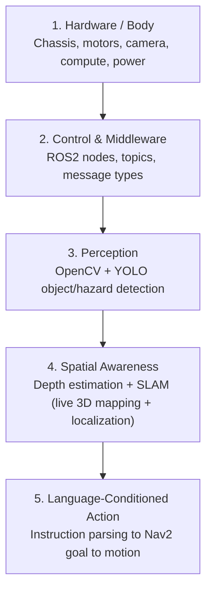

# Autonomous Perception Rover

**An edge-deployed, language-conditioned exploration rover for environments humans can't safely enter.**


---

## Table of Contents

- [Overview](#overview)
- [The Problem](#the-problem)
- [Why One Platform, Many Sectors](#why-one-platform-many-sectors)
- [Core Capability](#core-capability)
- [System Architecture](#system-architecture)
- [Tech Stack](#tech-stack)
- [Hardware](#hardware)
- [Roadmap](#roadmap)
- [Repository Structure](#repository-structure)
- [Getting Started](#getting-started)
- [Documentation](#documentation)
- [Project Status](#project-status)
- [Scope Discipline](#scope-discipline)
- [Author](#author)
- [License](#license)

---

## Overview

This project is an autonomous ground rover that explores unknown, unstructured, and hazardous environments — collapsed structures, unstable mine shafts, unknown or dangerous scenes — and does more than stream a raw camera feed back to an operator.

The rover:
- Explores on its own, without a pre-built map
- Builds a **live 3D understanding** of the space as it moves
- Uses computer vision to **understand what it's seeing** — hazards, objects, people — not just record it
- Responds to simple language-conditioned instructions, e.g. *"go to the red box"*

It's not a camera on wheels. It's a system that is spatially aware and can reason about, and act within, the space it's exploring.

## The Problem

Environments too dangerous for humans to enter first — post-fire structural collapse, unstable mining tunnels, unknown or active-danger scenes — all share the same bottleneck: getting reliable, actionable information out of the space *before* a person has to go in. Existing solutions are typically either expensive proprietary platforms or simple RC-controlled cameras with no onboard intelligence of their own.

## Why One Platform, Many Sectors

Fire & rescue, mining engineering, and law enforcement all need functionally the same core capability: **safe autonomous reconnaissance of an unknown, hazardous space before a human commits to entering it.** They just need it pointed at different hazards.

Rather than building three separate robots, this project builds **one core platform** — exploration, 3D mapping, and perception — with sector-specific detection modules added on top later as plug-ins, not rewrites.

## Core Capability

The proof-of-concept milestone this project is built around:

> Say **"go to the red box"** — the rover finds it using onboard vision, locates it in its live 3D map, and autonomously navigates to it while avoiding obstacles.

This is deliberately narrow in scope. It's a believable, demoable slice of language-grounded navigation that exercises every layer of the stack (perception, 3D mapping, navigation, language grounding) without requiring frontier-level VLA research to pull off.

## System Architecture

Five layers, each depending on the one below it:



Language-conditioned action is meaningless without spatial grounding, and spatial grounding is meaningless without a robot that can already move and see — hence the strict bottom-up build order.

## Tech Stack

| Layer | Tools |
|---|---|
| Compute | Raspberry Pi 5 |
| Middleware | ROS2 |
| Computer Vision | OpenCV, YOLOv8-nano (Ultralytics) |
| Depth / 3D | Depth camera (RealSense / OAK-D) or monocular depth estimation (Depth Anything), Open3D |
| SLAM | RTAB-Map / slam_toolbox |
| Navigation | Nav2 (ROS2 Navigation Stack) |
| Language | Rule-based parsing (v1) → small quantized local LLM (v2) |
| Edge Optimization | ONNX Runtime, quantization (INT8/FP16) |
| Simulation | Gazebo / Webots |
| Future Integration | FastAPI (external API layer), MQTT |

Full breakdown with learning priority and resources: see [`/docs`](./docs).

## Hardware

| Component | Notes |
|---|---|
| Raspberry Pi 5 | Core onboard compute |
| Rover chassis + motors | Any basic 4-wheel/tracked kit to start |
| Motor driver board | e.g. L298N or similar |
| Camera | Pi Camera Module / USB webcam (minimum viable) |
| Battery + power regulation | Independent mobile power |
| Depth camera *(planned upgrade)* | RealSense or OAK-D |
| LiDAR *(optional, later)* | e.g. RPLIDAR A1 |
| IMU *(optional)* | Improves SLAM/localization stability |
| Accelerator *(optional)* | Hailo-8 / Coral USB for faster on-device inference |

## Roadmap

| Phase | Timeframe | Milestone |
|---|---|---|
| 1 — Foundations | Month 1 | Manual teleop rover + standalone color-based object detection |
| 2 — Perception v1 | Month 2 | Live general object detection (YOLO) streamed over ROS2 |
| 3 — Spatial Awareness | Month 3 | Live 3D mapping (SLAM) + autonomous drive-to-coordinate |
| 4 — Language-Conditioned Action | Month 4 | **"Go to the red box"** — full language → action loop |
| 5 — Upgrade Pass | Month 5 | Robust detection + flexible language parsing + safety layer |
| 6 — Integration | Month 6+ | External API (FastAPI over ROS2) — platform is pluggable |

Full detailed roadmap (goals, learning resources, and demo criteria per phase) lives in [`/docs`](./docs).

## Repository Structure

```
.
├── docs/                 # Full roadmap, learning plan, research notes, architecture docs
├── hardware/             # Wiring diagrams, BOM, chassis notes
├── src/
│   ├── perception/       # OpenCV + YOLO detection nodes
│   ├── mapping/          # SLAM integration, depth handling
│   ├── navigation/       # Nav2 config, goal-sending logic
│   ├── language/         # Instruction parsing, visual grounding
│   └── bringup/          # ROS2 launch files, robot bringup configs
├── sim/                  # Gazebo/Webots simulation assets
├── tests/                # Unit/integration tests
└── README.md
```
*(Structure will evolve as the project moves past Phase 1 — this is the planned layout, not yet fully built out.)*

## Getting Started

> **Status: pre-hardware / early development.** Setup instructions will be filled in as each phase is built, starting with Phase 1 (manual teleop + basic detection).

Planned first steps once hardware is in hand:
1. Flash and set up Raspberry Pi 5 (headless, SSH-accessible)
2. Install ROS2 and verify basic node/topic communication
3. Wire up chassis + motor driver, confirm manual teleop control
4. Install OpenCV, confirm live camera feed access
5. Run first standalone detection script, then port into a ROS2 node

Detailed setup steps will be added per-phase under `/docs` as they're completed and verified on real hardware — nothing here is published until it's actually been run.

## Documentation

All research, planning, and learning materials for this project are tracked in [`/docs`](./docs), including:
- `docs/full-roadmap.pdf` — complete phased build roadmap (architecture, tech stack, hardware BOM, milestones, scope notes)
- `docs/learning-plan.pdf` — skills/learning checklist mapped to each build phase, with resources
- `docs/research/` — ongoing notes, references, and findings as the project progresses
- `docs/architecture/` — diagrams and design decisions as they're made

This README stays high-level on purpose; deeper detail belongs in `/docs` so it can grow without bloating this file.

## Project Status

🟠 **Early development — pre-hardware.** Currently working through Phase 1 foundations (ROS2 + OpenCV basics) before physical build begins. This README and `/docs` will be updated continuously as the project progresses — every phase, decision, and piece of research gets documented here, not just the finished result.

## Scope Discipline

This project deliberately starts narrow: one platform, one core capability ("go to the red box"), proven end-to-end before any sector-specific features (fire/mining/police) are attempted. Sector modules are planned as future plug-ins on top of a working core, not parallel efforts from day one. See `docs/full-roadmap.pdf` for the full reasoning.

## Author

Maintained by **[Alegbeleye Opeyemi]** — built as a personal/cohort project exploring edge robotics, perception, and language-grounded autonomy.

## License

*To be determined.*

---

*This repository is a living build log as much as a codebase — expect frequent updates to docs, research notes, and structure as the project moves through each phase.*